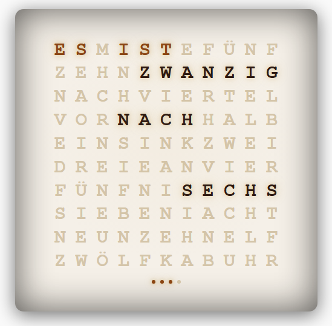
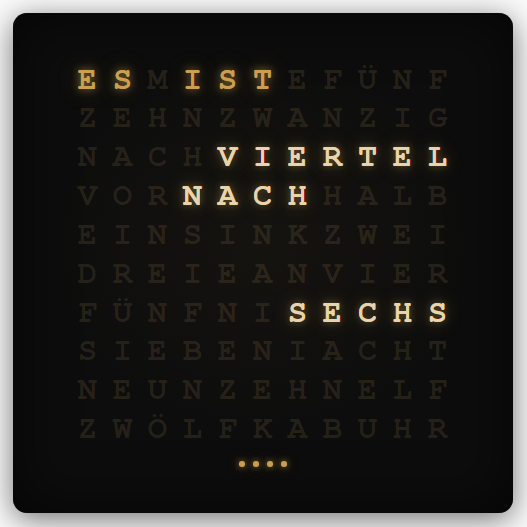
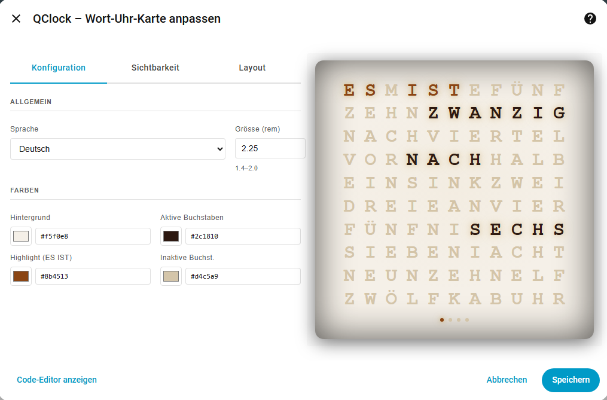
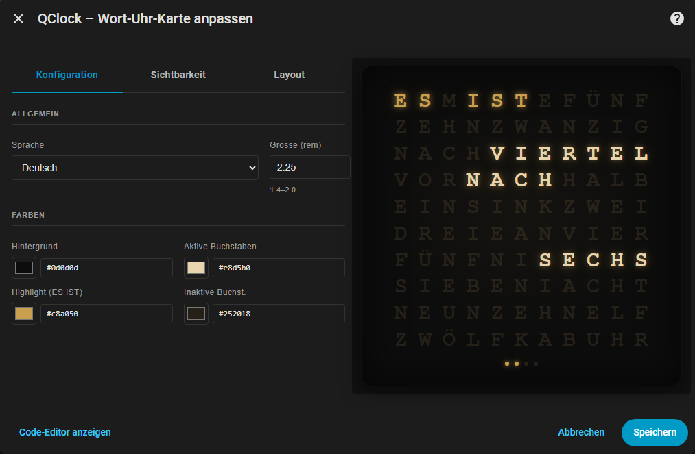

# QClock Card

**Eine Home Assistant Lovelace QClock Card.**

 
[![hacs_badge][hacsbadge]][hacs] 
[![github][ghsbadge]][ghs] 
[![BuyMeCoffee][buymecoffeebadge]][buymecoffee] 
[![PayPal][paypalbadge]][paypal] 
[![hainstall][hainstallbadge]][hainstall]

Go to the [English version](/README.md) version of the documentation.

## Inhaltsverzeichnis

* [Einführung](#einführung)
* [Installation](#installation)
* [Konfiguration](#konfiguration)


# Einführung

Die **QClock Card** ist eine konfigurierbare Wort-Uhr als Home Assistant Lovelace Karte, welche sich mit verschiedenen Einstellungen an das eigene Layout anpassen lässt. Hier als Beispiel zwei Screenshots.

* Helles Theme:
  

* Dunkles Theme:
  

Die Uhr gibt dabei die aktuelle Zeit in fünf-Minuten-Schritten in Wortform aus, wobei am unteren Rand vier Punkte die Minuten "dazwischen" markieren.

# Installation

**QClock Card** ist eine Default Lovelace Card in HACS. Zur Installation genügt es also, in HACS danach zu suchen, die Card hinzuzufügen und Home Assistant neu zu starten. Im Anschluss kann die Card im UI verwendet werden.

# Konfiguration

Nachdem die Karte auf dem UI hinzugefügt wurde, kann diese direkt dort konfiguriert werden. Dabei stehen die folgenden Optionen zur Wahl:

* Sprache
  * Deutsch
  * Englisch
  * Französisch
  * Italienisch
  * Spanisch
* Schriftgrösse
* Farben
  * Hintergrund
  * Farbe Satzanfang
  * Farbe der aktuellen Zeit-Wörter
  * Farbe der inaktiven Buchstaben

Die Farben können durch Klick auf das Farbfeld auch via Colorpicker ausgewählt werden. Je nach Layout sieht die Karte im Editiermodus bspw. so aus:

* Helles Theme:
  

* Dunkles Theme:
  

## Hier einige Farbvarianten:

* Warm/Klassisch – wie eine echte Holz-Wort-Uhr:
  ```
  Hintergrund:      "#f5f0e8"   # warmes Cremeweiß
  Satzanfang:       "#8b4513"   # Sattelbraun
  Zeit-Wörter:      "#2c1810"   # dunkles Dunkelbraun
  inaktive Zeichen: "#d4c5a9"   # helles Beige
  ```
* Cool/Modern – schlichtes Hellgrau:
  ```
  Hintergrund:      "#f0f0f0"   # hellgrau
  Satzanfang:       "#0066cc"   # klares Blau
  Zeit-Wörter:      "#1a1a2e"   # fast Schwarz mit Blaustich
  inaktive Zeichen: "#c8c8c8"   # mittelgrau
  ```
* Minimalst/Schwarz-Weiss:
  ```
  Hintergrund:      "#ffffff"   # reines Weiß
  Satzanfang:       "#555555"   # Dunkelgrau
  Zeit-Wörter:      "#111111"   # fast Schwarz
  inaktive Zeichen: "#dddddd"   # hellgrau
  ```


[hacs]: https://hacs.xyz
[hacsbadge]: https://img.shields.io/badge/HACS-Default-blue?style=for-the-badge&logo=homeassistantcommunitystore&logoColor=ccc

[ghs]: https://github.com/sponsors/starwarsfan
[ghsbadge]: https://img.shields.io/github/sponsors/starwarsfan?style=for-the-badge&logo=github&logoColor=ccc&link=https%3A%2F%2Fgithub.com%2Fsponsors%2Fstarwarsfan&label=Sponsors

[buymecoffee]: https://www.buymeacoffee.com/starwarsfan
[buymecoffeebadge]: https://img.shields.io/badge/buy%20me%20a-coffee-blue.svg?style=for-the-badge&logo=buymeacoffee&logoColor=ccc

[paypal]: https://paypal.me/ysswf
[paypalbadge]: https://img.shields.io/badge/paypal-me-blue.svg?style=for-the-badge&logo=paypal&logoColor=ccc

[hainstall]: https://my.home-assistant.io/redirect/config_flow_start/?domain=qclock_card
[hainstallbadge]: https://img.shields.io/badge/dynamic/json?style=for-the-badge&logo=home-assistant&logoColor=ccc&label=usage&suffix=%20installs&cacheSeconds=15600&url=https://analytics.home-assistant.io/custom_integrations.json&query=$.qclock_card.total

[tests]: https://github.com/starwarsfan/qclock-card/actions/workflows/test.yml
[tests-badge]: https://img.shields.io/github/actions/workflow/status/starwarsfan/qclock-card/test.yml?style=for-the-badge&logo=github&logoColor=ccc&label=Tests

[coverage]: https://app.codecov.io/github/starwarsfan/qclock-card
[coverage-badge]: https://img.shields.io/codecov/c/github/starwarsfan/qclock-card?style=for-the-badge&logo=codecov&logoColor=ccc&label=Coverage
